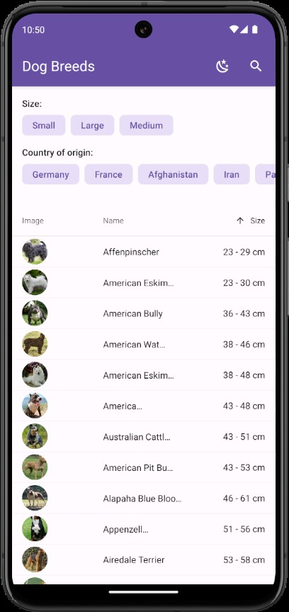
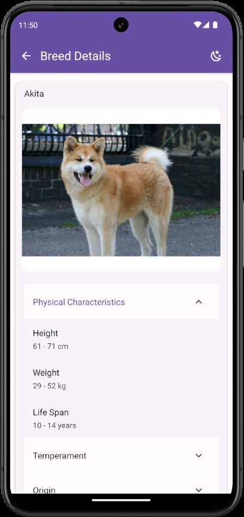
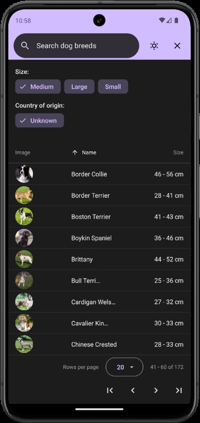
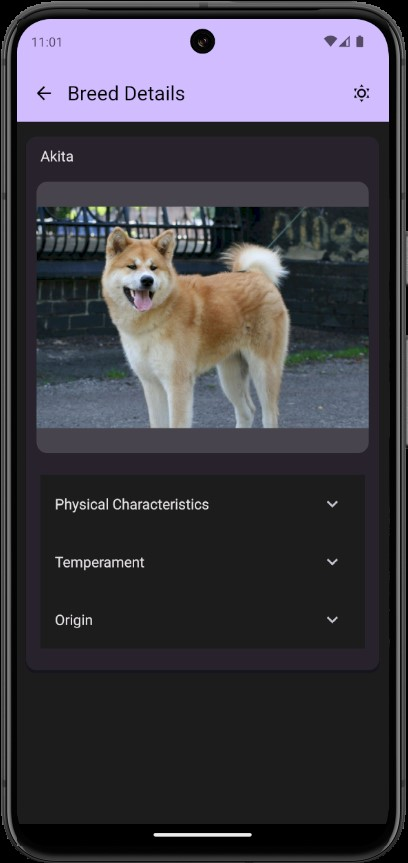

# DoggyDogWorld 🐶

   

A cross-platform React Native application using Expo that runs on Android, iOS, and web, allowing users to search, filter, sort, and learn about dog breeds using [The Dog API](https://thedogapi.com).

## Get started

Before you begin, make sure you have [Node.js](https://nodejs.org/en) (v18 or newer recommended) installed and set up your development environment by following the [Expo environment setup guide](https://docs.expo.dev/get-started/set-up-your-environment/).

1. Install dependencies

   ```bash
   npm install
   ```

2. Start the app

   ```bash
   npm start
   ```

   In the output, you'll find options to open the app in a:

   - browser
   - [development build](https://docs.expo.dev/develop/development-builds/introduction/)
   - [Android emulator](https://docs.expo.dev/workflow/android-studio-emulator/)
   - [iOS simulator](https://docs.expo.dev/workflow/ios-simulator/)
   - [Expo Go](https://expo.dev/go), a limited sandbox for trying out app development with Expo

   Alternatively, you can launch the app directly on one of the supported platforms:

   ```bash
   npm run android
   npm run ios
   npm run web
   ```

### Running tests

The project uses Jest and React Native Testing Library for unit testing. To run all tests:

```bash
npm test
```

## Features and design decisions

- **Server-side pagination** and **searching**
- **Detailed view** of dog breeds to display additional information
- Extending the API capabilities with on-page features:
  - Dynamic filter options derived from the union of the current page's data
  - **Filtering** based on breed size and country of origin
  - **Sorting and ordering** based on breed name and size
  - Offline searching
- **Material Design 3** with **dark mode** support using React Native Paper UI library
- Using React Native's built-in Animated API for **smooth transitions** between states and **skeleton loaders** while fetching data
- **URL parameters for state management**
  - Centralized state that can be accessed across components
  - Shareable and persistent application state on the web through URLs
  - Simplified state management using hooks and helper functions provided by Expo Router
- **React Query** for data fetching that offers efficient server-state management with built-in caching mechanisms
- **Offline support with Async Storage:** persisting the current page between sessions and providing visual indicators when displaying cached data
- **Zod schema validation** for type safety to ensures data integrity throughout the application and catch bugs early
  - Parsing and validating all external data source such as API responses and URL parameters
  - Transformation capabilities for data normalization in a single step
- Excessive **error handling** with banners, toasts, and error screens
- Modular architecture with **reusable components** and **custom hooks** to encapsulate complex logic, and a separate **service layer for API requests**

## Notes

- The implementation of dog breed images in the table is kept on the `table-images` branch because the table component does not support virtualization which led to performance issues on large page sizes

## Project structure

- `app` - [file-based routing](https://docs.expo.dev/develop/file-based-routing/)
- `components` - React components
- `lib` - core utilities and helper functions
  - `api.ts` - API service layer
  - `hooks.ts` - React hooks
  - `storage.ts` - Async Storage utilities
  - `breed-schemas.ts` - schemas for API response validation
  - `params-schemas.ts` - schemas for query parameter validation
- `__tests__` - unit tests
